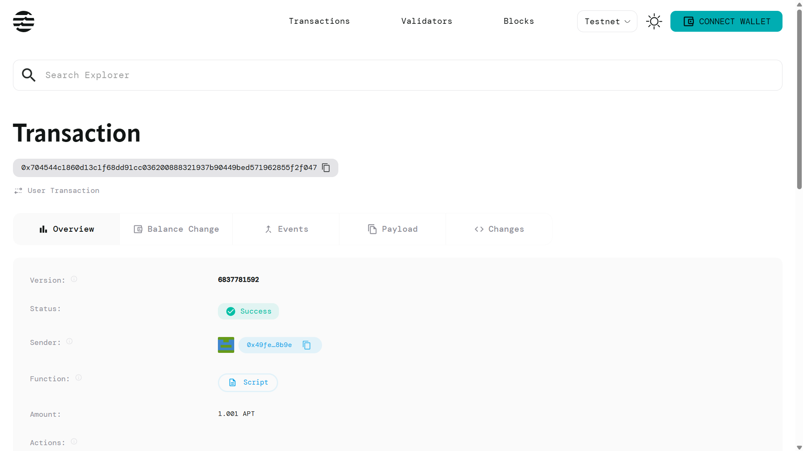

# Digital Certificate Verification

## Project Title
**Digital Certificate Verification System on Aptos Blockchain**

## Project Description
The Digital Certificate Verification System is a revolutionary blockchain-based solution that transforms the way educational and professional certificates are issued, stored, and verified. Built on the Aptos blockchain, this system creates tamper-proof digital certificates that eliminate fraud, reduce verification time, and provide instant authenticity confirmation.

This decentralized platform serves as a digital diploma system where educational institutions can issue blockchain-verified certificates to students, and employers or other parties can instantly verify the authenticity of these credentials without needing to contact the issuing institution directly.

## Project Vision
Our vision is to create a world where certificate fraud is eliminated through blockchain technology, making educational and professional credential verification instant, transparent, and completely trustworthy. We aim to:

- **Eliminate Certificate Fraud**: Make it impossible to forge or fake certificates using blockchain's immutable ledger
- **Streamline Verification Process**: Reduce verification time from days/weeks to seconds
- **Global Accessibility**: Create a universal system accessible to institutions and verifiers worldwide
- **Cost Reduction**: Minimize the administrative costs associated with manual certificate verification
- **Digital Transformation**: Bridge the gap between traditional paper-based certification and the digital age

## Key Features

### 🔐 **Tamper-Proof Security**
- Certificates stored on Aptos blockchain with cryptographic hashing
- Immutable records that cannot be altered or deleted once issued
- Advanced encryption ensures data integrity and authenticity

### ⚡ **Instant Verification**
- Real-time certificate verification through smart contracts
- QR code scanning for quick mobile verification
- No need to contact issuing institutions for authentication

### 🏫 **Multi-Institutional Support**
- Support for universities, colleges, training institutes, and certification bodies
- Role-based access control for different types of institutions
- Scalable architecture to handle multiple certificate types

### 📱 **User-Friendly Interface**
- Intuitive web interface for certificate issuance and verification
- Mobile-responsive design for on-the-go verification
- Dashboard for managing certificates and tracking verification requests

### 🔄 **Certificate Lifecycle Management**
- Issue certificates with unique identifiers and metadata
- Revocation capability for institutions when needed
- Historical tracking of all certificate activities

### 🌐 **Decentralized Architecture**
- Built on Aptos blockchain for high performance and low fees
- Decentralized storage ensures no single point of failure
- Cross-platform compatibility and API access

## Future Scope

### Phase 1: Core Implementation
- Basic certificate issuance and verification functionality
- Integration with major educational institutions
- Web-based verification portal

### Phase 2: Enhanced Features
- **Mobile Application**: Native iOS and Android apps for certificate management
- **Batch Processing**: Bulk certificate issuance for graduation ceremonies
- **Integration APIs**: REST APIs for third-party integrations with HR systems
- **Analytics Dashboard**: Comprehensive analytics for institutions and administrators

### Phase 3: Advanced Capabilities
- **AI-Powered Verification**: Machine learning algorithms for fraud detection
- **Multi-Language Support**: Internationalization for global adoption
- **IoT Integration**: Integration with IoT devices for automated verification
- **Credential Wallet**: Personal digital wallet for certificate holders

### Phase 4: Ecosystem Expansion
- **Professional Certifications**: Support for industry certifications and licenses
- **Skill-Based Credentials**: Micro-credentials and skill-based certifications
- **Cross-Chain Compatibility**: Integration with other blockchain networks
- **Regulatory Compliance**: Adherence to international education standards and regulations

### Long-term Vision
- **Global Standard**: Become the global standard for digital certificate verification
- **Government Partnerships**: Collaborate with government agencies for official document verification
- **Enterprise Solutions**: Full-scale enterprise solutions for large organizations
- **Decentralized Identity**: Integration with broader decentralized identity ecosystems

## Contract Details
0x704544c1860d13c1f68dd91cc036200888321937b90449bed571962855f2f047
